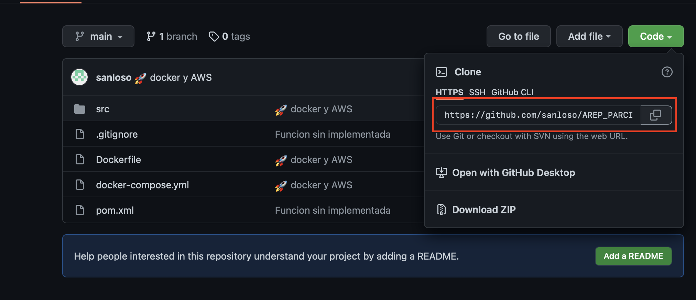
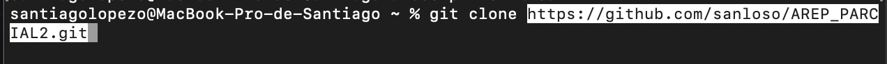
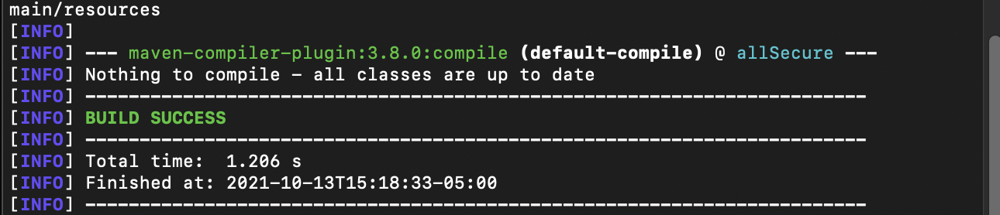
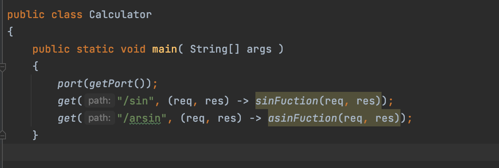
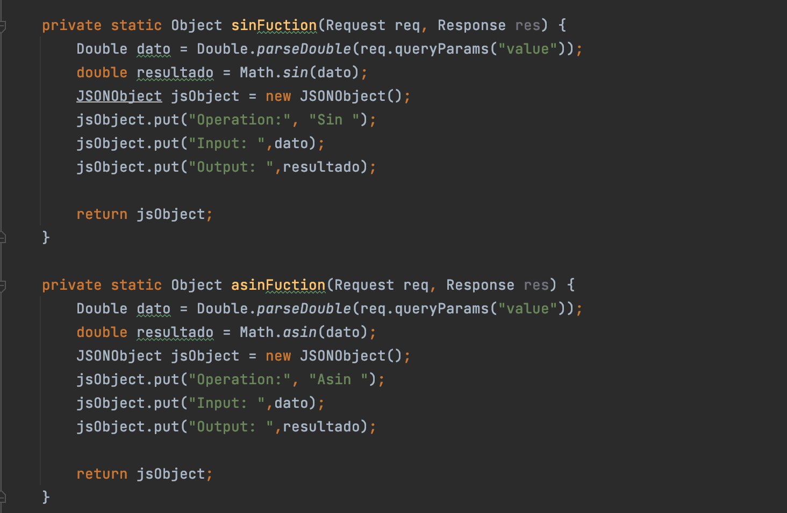
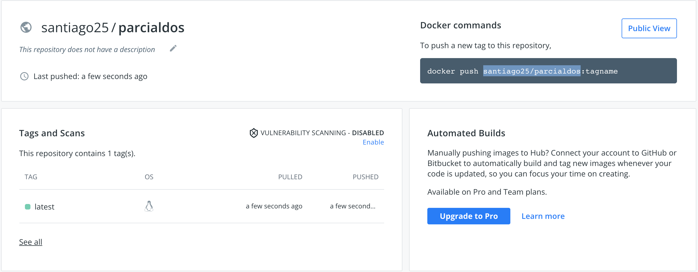
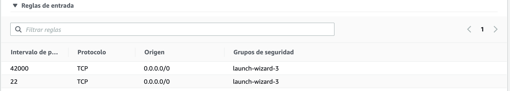
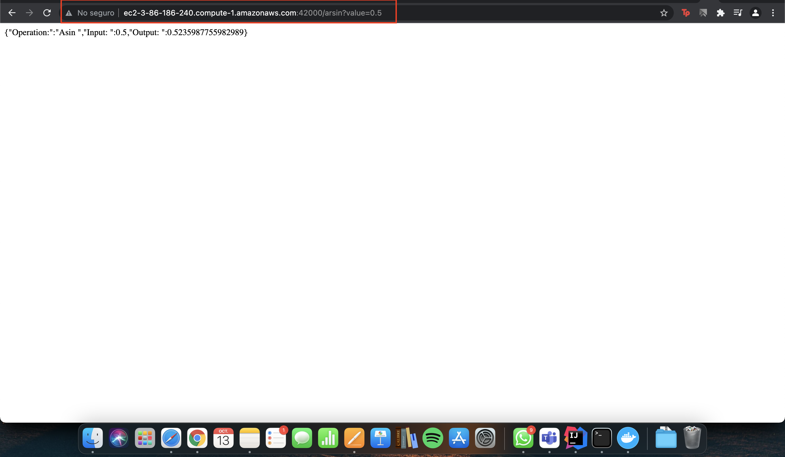

# Parcial Segundo Tercio AREP

## Entorno 

Se realiza una aplicación la cual tiene 2 funciones matemáticas que son **sin** y **asin** 

para clonar este repositorio dirigase a este link:

[repositorio](https://github.com/sanloso/AREP_PARCIAL2.git)

cuando se encuentre en la paguina oprima el boton code y copie el link 



luego ingrese a su terminal, dirigase a la carpeta donde desee clonar el repositorio y coloque el siguiente comando 

```
git clone <link>
```




para compilar el codigo ejecutre 

```
mvn compile
```

debería obtener un resultado así



En este punto ya esta listo para ejecurtalo.

## Desarrollo del código

Se crea una clase llamada **Calculator** en donde se exponen 2 servicios **(sin, arsin)** para responder al método de solicitud HTTP GET. 



luego estos servicios llaman a una función en donde se hace la respectiva función matemática y también se crea el objeto json para devolver el resultado de dicha
función




## Despliegue en docker y AWS

Inicialmente se crea el docker file y el docker compose. Luego se crea la imagen y se sube al docker hub. 



después de esto, se realiza una instancia en AWS EC2 para alojar la imagen del docker. Para esto descargamos docker en la maquina virtual con este comando 

```
sudo yum install docker
```

Luego inciamos el servidor de docker 

```
sudo service docker start
```

Y finalmente creamos una instancia de un contenedor docker a partir de la imagen creada anteriormente

```
docker run -d -p 42000:6000 --name … santiago25/parcialdos
```
Despues de esto nos vamos a la instancia EC2 y modificamos las reglas de entrada para que pueda acceder cualquier persona usando el puerto 42000



Luego se podra acceder con el link dado por AWS de esta manera 



## Video de prueba

[Video Youtube](https://youtu.be/vt5fpE0bzSY)
